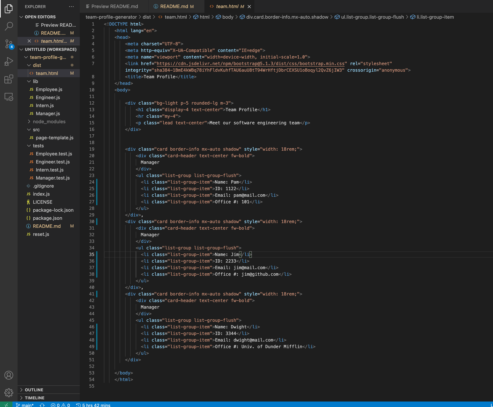

# Team Profile Generator

## Description

This is a command-line application that will allow users to input information about employees on a software engineering team, and will then create an HTML webpage displaying the team's profiles. This is accomplished using Inquirer in Node.js and includes unit tests, using Jest, for each new type of employee that is constructed.

## License


## Technologies Used

    * Javascript
    * Node.js
    * Inquirer
    * Jest


## What I Learned

This was an intimidating project to begin, requiring more code written from scratch than anything I've worked on yet. Breaking the application down into smaller tasks and keeping the code in an organized file structure was very helpful in moving forward.

Reading API documentation was another huge help in this project, as well as seeing how writing unit tests can help in designing simple code that accomplishes its given task.

One of my most persistent challeges in building this application was keeping in mind the parameters that get passed into constructor functions. For example, I was passing "answers" from Inquirer questions into the new Employee constructors, which created some oddly structured objects rather than each prompt answer filling its designated property. This was fixed by paying attention to the order parameters were passed in and how they were called.

## Usage

You will begin by typing the following into your terminal, to install the inquirer and jest dependencies:

```
npm i
```
And then to run the application and begin building your team:

```
npm start
```
Follow the prompts to enter the content you wish to include in your team's profiles.

To run unit tests, run:

```
npm run test
```


## Team Profile Generator Walkthrough

https://watch.screencastify.com/v/v5aPY2tPZIVoa2XbYfyJ

## URL for GitHub Repo

https://github.com/ChristinaBohn/team-profile-generator

## Sample Generated Team Profile HTML file

